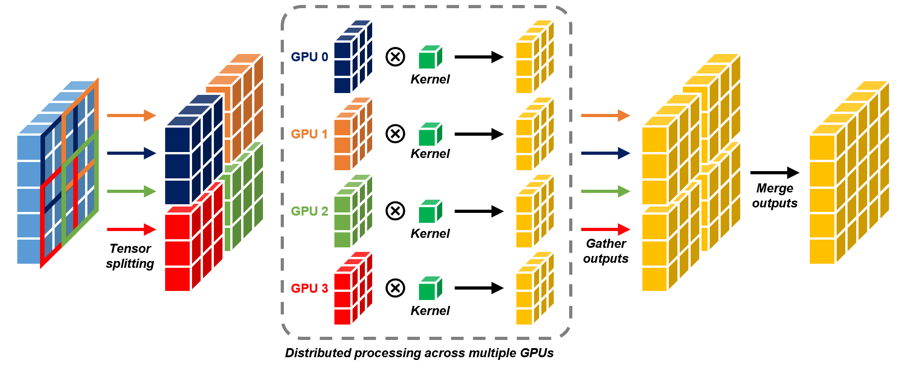

# MAISI VAE with Multi-GPU Tensor Splitting Parallelism

Generating high-resolution 3D CT volumes is costly, requiring substantial compute and memory due to large feature maps used in 3D CNNs. To address this, NVIDIA introduced the MAISI VAE, which compresses CT volumes into latent space for efficient generative modeling. Rather than relying on sliding-window inference (which causes boundary artifacts), they propose **Tensor Splitting Parallelism (TSP)** to divide feature maps into smaller segments, distributing them across multiple devices, and merging them to yield the layer's output. 

Concurrent processing across multiple devices significantly accelerates inference. It also reduces peak memory usage on a single device by allowing segments to be processed sequentially. However, the current open-source implementation of MAISI VAE does not support multi-device TSP. Instead, it relies on sequential single-device processing and frequent costly GPU-to-CPU data transfers for merging layer outputs. This creates bottlenecks for downstream applications through inefficient utilization of GPUs and slow inference.

*Figure inspired by Guo et al. WACV 2025.*

## Usage

An improved version of `AutoencoderKLMaisi` implements multi-device TSP and several tweaks to reduce cost GPU-to-CPU communication bottlenecks. It is a drop-in replacement for [`AutoencoderKLMaisi`](https://github.com/Project-MONAI/MONAI/blob/main/monai/apps/generation/maisi/networks/autoencoderkl_maisi.py). You can replace all `AutoencoderKLMaisi` imports with the code provided in this repository [here](./src/autoencoderkl_maisi.py). Note that a new argument `num_devices` to control the number of devices for TSP is added (defaults to 1). Setting this to `None` uses all available GPUs for TSP.

An example is also provided [here](./src/extras/demo.ipynb). For further details, please follow their instructions on [NVIDIA-Medtech/NV-Generate-CTMR](https://github.com/NVIDIA-Medtech/NV-Generate-CTMR). 

## Benchmark

The encoding and decoding performance of the improved MAISI was benchmarked against the original open-sourced implementation. The inference time (in seconds) and peak VRAM use (in GB) is measured for a 3D CT volume of $512 \times 512 \times 192$ voxels with $0.75 \times 0.75 \times 1.5$ spacing. In all cases, mixed-precision is used with memory saving enabled on up to 4 NVIDIA H200 GPUs. The improved MAISI VAE achieved significantly faster inference time in both single-device and multi-device TSP settings. Interestingly, the additional overhead of launching CUDA kernel on multiple devices often outweights the performance of single-device cuDNN optimization.

| **Method** | $\mathbf{N}_\textbf{splits}$ | $\mathbf{N}_\textbf{devices}$ | **Encoding** | **Decoding** |
| :-- | :--: | :--: | :--: | :--: |
| MAISI | 1 | 1 | 832.39s (19.24 GB) | 1,543.97s (49.89 GB) |
| MAISI, Improved | 1 | 1 | 467.3s (24.68 GB) | 1040.41s (49.89 GB) |
| MAISI | 2 | 1 | 465.28s (27.48 GB) | 1,342.77s (44.1 GB) |
| MAISI, Improved | 2 | 1 | 15.24s (30.51 GB) | 693.23s (73.16 GB) |
| | 2 | 2 | 16.23s (30.48 GB) | 675.87s (73.24 GB) |
| MAISI | 4 | 1 | 523.8s (23.12 GB) | 726.13s (47.52 GB) |
| **MAISI, Improved** | **4** | **1** | **13.49s (30.72 GB)** | **23.23s (72.86 GB)** |
| | 4 | 4 | 14.09s (30.76 GB) | 24.53s (72.93 GB) |

## Resources

For further details, please refer to the below references:

- [NV-Generate-CTMR on GitHub](https://github.com/NVIDIA-Medtech/NV-Generate-CTMR)
- [NV-Generate-CT on HuggingFace](https://huggingface.co/nvidia/NV-Generate-CT)
- [MAISI (v1) paper from WACV 2025](https://arxiv.org/pdf/2409.11169)
- [MONAI](https://monai.io/)

## Contact

For any questions, feel free to reach out via email: pranavk@umd.edu.